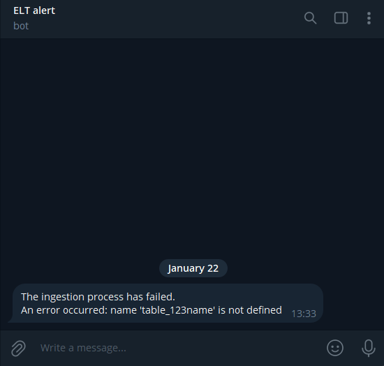

### ELT dbt

The initial batch of data is generated and is under seeds folder, which is for all intents and purposes ignored from the repo.  
After that, each hour/day/week there's an additional CSV file depenging on the parameters set.  
Orchestrated by Astronomer with Docker.

It is ridiculous how much Go crushed Python in terms of performance.  
30M rows generated in a minute is a wild result.  
For comparison 11M took Python just under 10 minutes. So aprox 30x difference. 
Unfortunately faker for Go is somewhat worse.

The ingestion script will scan through the /seeds directory and ignore the files the tables for which already exist.  
If ingestion fails it will send a message to a Telegram bot with respective error. It is kinda cool ngl  

